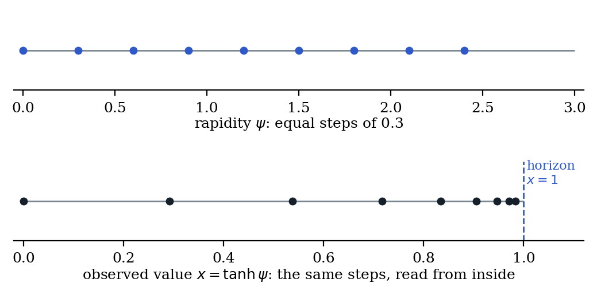

# 1. Introduction: the flat default, and what this paper claims

Much of quantitative science inherits one assumption from Euclid: quantities extend without limit, and limits are added afterwards. Ceilings enter models as caps, clipping, saturation terms or constraints. The default space is flat, and a bound is an exception to it.

Yet the quantities we measure are very often bounded. Speeds are bounded by $c$. Fractions, probabilities and occupancies are bounded by 0 and 1. Concentrations are bounded by the pools they are drawn from, beliefs by certainty, and reflection coefficients by total reflection.

This paper takes the opposite default. The limit comes first, and together with a lawful way of combining changes it generates the structure.

## 1.1 The claim, stated with its scope

**The law.** If a quantity is bounded and its changes combine continuously, associatively, monotonically and with a resting state, then there is a coordinate in which changes add, and the bound sits at infinity in that coordinate (Theorems 1–2). We call this the Universal Hyperbolic Law. It is universal in the sense every theorem is universal: it holds without exception for every system that satisfies its conditions. Which real systems satisfy them is an empirical question, answered system by system (§13). No prevalence across nature is claimed or measured here.

**What is classical.** The ingredients are old, and we use them as such.

- **Ordered structures.** Hölder (1901) showed that an Archimedean ordered group embeds in $(\mathbb R,+)$. Aczél (1949, 1966) proved that every continuous, associative, strictly monotone operation on an interval has an additive coordinate. In measurement theory, Luce and Marley (1969) axiomatised bounded concatenation with a maximal element, with relativistic velocity as the motivating example; Luce and Narens (1976) gave the first qualitative characterisation of the relativistic addition law; Krantz, Luce, Suppes and Tversky (1971) built the general programme of earning a numerical scale from qualitative axioms. In fuzzy aggregation the same operations are the representable uninorms (Dombi 1982; Fodor, Yager and Rybalov 1997), and the rational one-horizon laws are Hamacher's family (Hamacher 1978; Klement, Mesiar and Pap 2000).
- **Relativity and geometry.** Einstein (1905), Varićak (1910), Ignatowski (1910), Bacry and Lévy-Leblond (1968), Lévy-Leblond (1976), Anker and Ziegler (2020); the Cayley–Klein classification (Yaglom 1979); Ungar (2008) for gyrogroups; Friedman (2005) for physics on bounded balls; Kay (1967) and Foertsch and Karlsson (2005) for which bounded domains are hyperbolic or flat; Faraut and Korányi (1994) for symmetric cones.
- **Bounded addition beyond velocity.** Vigoureux (1992) and Giust, Vigoureux and Lages (2009) for reflection coefficients; Monzón et al. (2002) and Barriuso et al. (2004) for the classification and the Wigner angle of multilayers; Hájek (1985) and Heckerman (1986) for certainty degrees; Amari and Nagaoka (2000) for the Legendre duality behind Theorem 3; Osgood (1898) and Feller (1952) for arrival at a boundary.
- **Measured hyperbolic information spaces.** Krioukov et al. (2010) for networks; Zhou, Smith and Sharpee (2018) for olfaction; Zhang, Rich, Lee and Sharpee (2023) for the hippocampus; Klimovskaia et al. (2020) for single cells.

**What is new here.** Five things, each modest, each testable:

1. **A conditions-based law across domains**, with a protocol that tests the conditions (§13) and a register that sorts known puzzles by which condition holds or fails (§12).
2. **Where the law applies and where it stops.** A scalar summary of history has three fates (Proposition 1); interventions must also pass an action gate (§5.1); maximum-entropy averages have horizons, with a boundary exponent of at least 1 set by the reference measure and an explicit lower bound on the remaining gap (Proposition 3); two mechanisms share a rapidity exactly when their order effect vanishes (Proposition 6); arrival at a ceiling is decided by a boundary exponent (Theorem 18, Proposition 9); and the far side of the horizon carries the same law (Theorem 19).
3. **The observer's route to projectivity, and what the cone of the observer's channels decides** in higher dimensions: which reversible updates preserve a geometry, which forward-only updates contract it, and why the measured distance also depends on the observer's comparison (Theorems 6 and 25).
4. **An interaction law in rapidity**, and the conditions under which detailed balance forces a sinh coupling (Theorems 13–16).
5. **The classical drug-combination laws placed on one Hamacher dial** (Theorem 8), together with a pre-registered test of the mechanistic reading of that dial, which failed as stated (§13.3).

**The name.** "Universal Hyperbolic Law" is unrelated to Wildberger's *Universal Hyperbolic Geometry* (Wildberger 2013).

**Words.** "Lawful" means satisfying conditions C1–C4 of §2.1, and nothing more. "Horizon" means an end of the interval that sits at infinite rapidity. In one dimension we speak of the *nonlinearity of a chart*, never of curvature; geometric curvature enters only in two or more dimensions (§8).

## 1.2 Order of the argument, and corrections to earlier work

**Logical order.** The order of gates is: physical access → predictive state → admissible actions → chart and boundary kinetics → operational geometry → held-out prediction. A quantity can obey a composition law only if it is first a *state*: histories it identifies must have the same future under every admissible intervention (Theorem 10; Murray 2026a, 2026h). Its interventions must then pass a separate gate: an intervention's endpoint from rest must determine its action from every state (§5.1). Predictive closure is therefore logically prior to this law, and the law begins where a scalar summary has earned regular closure (Proposition 1). We present the law first because it is the object of this paper, but every application goes through the state and action tests first (§13, steps 0 and 2).

**Where this paper corrects the author's earlier work.**

- Boundedness alone does not select the artanh chart (§2.4). This corrects Murray (2026c) and the one-dimensional step of Murray (2026r).
- The rapidity is unique up to positive scale, with zero fixed by the neutral state, not "up to positive affine" maps as stated in Murray (2026g, 2026k).
- Bounded gyro-associative composition does not by itself force Einstein addition, as Murray (2026s) and Murray (2026d, §8) suggested. A rigidity condition or a holonomy selector is needed (§8).
- Bliss independence is hyperbolic, not parabolic, as stated in Murray (2026t).
- The "exactly five classes" of Möbius drug-combination laws (Murray 2026b) hold only when fixed points are restricted to $\{0,1,\infty\}$ (Murray 2026e, Theorem B); Theorem 8 gives a continuum.
- Version 1.0 of this paper claimed that the dial position measures mechanistic overlap. That prediction was tested and failed (§13.3); it is restated here.
- An earlier draft of version 2.0 credited Luce and Marley (1969) with deriving the relativistic addition law. They did not; Luce and Narens (1976) did.
- Version 2.0 treated every positive update of a cone as an automorphism, stated observer centrality for all bounded laws, gave a fixation test (H6) that does not probe the far side of the horizon, and stated H7 without dimension or distortion assumptions. Version 2.1 corrects all four (Theorems 25 and 29, §7.4, §8.4), following an external review whose mathematical claims were each checked here.

**Plan.** Part I states and proves the law (§2–§8). Part II reads it in physics, life and mind and sorts known puzzles (§9–§12). Part III gives the protocol, the two empirical results and the claim register (§13–§15). Appendix A holds proofs; Appendix B the verification record.

**Status tags.** Every claim carries one of three tags:

- **[P]:** proven here; or a classical result with a citation; or proved in full in a cited paper by the author, in which case §15 names the paper and the result awaits independent checking like a [D].
- **[D]:** derived here, with the proof in the text or in Appendix A. It awaits independent checking.
- **[H]:** a hypothesis, with a stated test and a stated loss condition.

# Part I — The Law

# 2. When a bounded quantity has a law, and what the law says

## 2.1 Conditions

Let a quantity $x$ take values in an interval $I$ with at least one finite end. Let changes combine by an operation $\oplus: I \times I \to I$. The law requires four conditions:

- **C1 (continuity).** Small changes in the inputs give small changes in the result.
- **C2 (associativity).** $(a\oplus b)\oplus c = a\oplus(b\oplus c)$. How past changes are grouped does not matter.
- **C3 (strict monotonicity).** Increasing either input strictly increases the result.
- **C4 (neutral state).** There is an element $e$ with $a\oplus e = e\oplus a = a$.

Boundedness alone forces nothing. The law is boundedness together with lawful combining. C3 is the condition that does the most work: it is what distinguishes a *strict* operation, whose generator diverges at the bound, from a *nilpotent* one, whose generator is finite there and whose bound is reached (Ling 1965; Klement, Mesiar and Pap 2000). The bounded sum $\min(1,a+b)$ is associative, continuous and monotone, but not strictly so at the bound; it reaches its ceiling. Section 7 says what decides, physically, which kind a system is.

## 2.2 The three fates of a scalar summary

**Proposition 1 (closure trichotomy; Murray 2026a).** Suppose a scalar summary $L(h)$ of a history $h$ is proposed as a state, and suppose sequential histories combine by $L(h_1;h_2)=F(L(h_1),L(h_2))$. Then exactly one of three cases holds:

- **Case I (no closure).** No single-valued $F$ exists. Equal values of $L$ support different futures, so $L$ is not a state.
- **Case II (lawful closure outside the regular class).** $F$ exists and is associative, but a regularity condition fails: continuity (C1), strict monotonicity (C3), the neutral state (C4), or cancellativity. Idempotent, absorbing, max-like and min-like laws are examples. They erase distinctions irreversibly while remaining lawful.
- **Case III (regular closure).** $F$ satisfies C1–C4. The law of this paper applies.

Status: [P]. Associativity follows because concatenation of histories is associative.

This paper is the theory of Case III. Theorem 18 locates every arrival at a boundary in Case I or II, in an unbounded drive, or in a change of law.

## 2.3 The horizon theorem

**Theorem 1 (group case: neutral state inside).** Suppose $e$ lies inside $I$. Then there is a continuous increasing bijection $\psi: I \to \mathbb{R}$ with $\psi(e)=0$, the *rapidity*, such that
$$a\oplus b = \psi^{-1}\big(\psi(a)+\psi(b)\big).$$
$\psi$ is unique up to a positive scale factor. Both ends of $I$ lie at $\psi = \pm\infty$, and three consequences follow:

- No finite sequence of changes reaches either end.
- No change other than $e$ returns to $e$ by repetition.
- Every change generates a flow $t\mapsto\psi^{-1}(t\psi(a))$ that approaches the ends only as $t\to\pm\infty$.

Status: [P]. Aczél's theorem gives $\psi$ onto an interval $K \ni 0$ closed under addition; an interval closed under addition that contains $0$ in its interior is all of $\mathbb{R}$, and $0=\psi(e)$ is interior because $e$ is. In measurement theory this is a bounded extensive structure (Luce and Marley 1969); in fuzzy aggregation, a representable uninorm (Fodor, Yager and Rybalov 1997). The operation is commutative, so a single associative scalar law cannot encode the order of its inputs (§5.1).

**Theorem 2 (monoid case: neutral state at an end).** Suppose $e$ sits at the finite end $\alpha$ of $I=[\alpha,\beta)$. Then there is a continuous increasing bijection $\psi: I\to[0,\infty)$ with the same additive law. The far end $\beta$ is at $\psi=+\infty$, and no finite sequence of changes reaches it.

Status: [P]. Aczél's theorem applies on $[\alpha,\beta)$, because C3 gives cancellativity. Ling (1965) covers the weakly monotone Archimedean case, which is where the nilpotent laws live.

The **group case** has two horizons and a resting state between them: velocity, belief, the logit law. The **monoid case** has one horizon and a resting state at the other end: dose effects that start from zero, survival under independent hazards, accumulating damage.

{width=90%}

## 2.4 What the law fixes, and what the system supplies

The law has two layers:

- **Universal layer:** a rapidity exists, the horizons sit at infinite rapidity, and change is additive in rapidity. C1–C4 force these.
- **Local layer:** the system's own physics supplies which rapidity applies, through the definition of the quantity, its microscopic states and its mechanism.

Boundedness does not select the chart. A tangent-based law and Einstein's law both satisfy C1–C4 on $(-1,1)$, yet they combine 0.3 and 0.5 differently: 0.63 against 0.70. Any increasing bijection $\psi:(-1,1)\to\mathbb R$ defines a lawful bounded group, and for generic $\psi$ its maps are not fractional-linear (Murray 2026a). The axioms cannot tell these laws apart; only the system can. Sections 3 and 4 show how the system decides.

# 3. Which chart: maximum entropy, and the flat limit

## 3.1 The rapidity is the gradient of negentropy

When a bounded quantity is the average of a microscopic variable at maximum entropy, its natural coordinate is forced. That coordinate is the slope of the negentropy. The neutral state is the maximum-entropy state, and the horizons are where fluctuations vanish.

**Setting.** Let a microscopic variable $s$ take values in a bounded set $S\subset[s_{\min},s_{\max}]$ with reference measure $\mu$, finite and not concentrated at one point. Take the distribution of maximum entropy with a given mean $m$: $p_\theta(s)\propto e^{\theta s}$ relative to $\mu$.

**Theorem 3 (negentropy).**

1. The map $\theta\mapsto m(\theta)$ is an increasing bijection from $\mathbb{R}$ onto the interior of the convex hull of $\operatorname{supp}\mu$.
2. $\theta = dJ/dm$, where $J(m)$ is the negentropy: the entropy deficit, relative to $\mu$, below its maximum.
3. The generator of the flow $\theta\mapsto m$ is $X(m) = dm/d\theta = \mathrm{Var}_\theta(s)$. Horizons are exactly the states where fluctuations vanish.
4. $\theta=0$ is the maximum-entropy state. As $m$ approaches either end, $\theta\to\pm\infty$ and the entropy decreases to a limit: $\ln\mu(\{s_{\mathrm{end}}\})$ when the end value is an atom of $\mu$, and $-\infty$ when it is not.

Status: [P], classical (Barndorff-Nielsen 1978; Amari and Nagaoka 2000; Wainwright and Jordan 2008). The contribution is the reading: the rapidity of a maximum-entropy bounded quantity is the slope of its negentropy.

**Proposition 2 (negentropy in rapidity).** For two states, $J(\theta)=\theta\tanh\theta-\ln\cosh\theta$, which is $\approx\theta^2/2$ near rest and rises to $\ln2$ at either horizon; along any motion $dJ/dt=\theta(1-m^2)\dot\theta$. Status: [P], the Legendre dual of item 2 (A.15). Perfect order is a horizon: each unit of rapidity near it buys an exponentially smaller gain in negentropy. Near rest the negentropy is the quadratic excess in rapidity, which is the energetic reading used for recovery after perturbation in Murray (2026k); away from rest the two correspond only monotonically.

**Proposition 3 (maximum-entropy averages never reach their ceiling).** Under the setting above, with $L=s_{\max}-s_{\min}$,
$$X(m)=\mathrm{Var}_\theta(s)\le L\,(s_{\max}-m),$$
so the generator vanishes at least linearly at the ceiling, and $\int^{s_{\max}}dm/X(m)=\infty$. A finite drive in $\theta$, or any dynamics $\dot m=k\,X(m)$ with $k$ bounded, therefore never reaches the ceiling. In the three commonest cases the exponent is exact: $X\sim(s_{\max}-m)^\gamma$ with $\gamma=1$ when $\mu$ has an isolated atom at $s_{\max}$ (two states, the logit chart), $\gamma=2$ when $\mu$ has no atom at the end and a density $\sim u^a$, $a>-1$, there (the Langevin chart, and every density continuous and positive at the end), and, when an atom at $s_{\max}$ meets a density $\sim c\,u^a$ ($a>-1$) beside it, $\gamma=1+1/(a+2)$, which runs continuously from 2 ($a\to-1$) to 1 ($a\to\infty$) and equals $3/2$ for a density positive at the end. Every reference measure gives $\gamma\ge1$. There is no upper bound: a density $e^{-1/u}$ at the end gives $X\approx(s_{\max}-m)^3/2$, so $\gamma=3$.

**Corollary (the cost of approach).** Along any motion driven by a nonnegative rate $k(t)=\dot\theta$, the remaining gap $\delta=s_{\max}-m$ obeys
$$\delta(t)\ge\delta(0)\exp\Big[-L\int_0^t k\,dt'\Big].$$
This turns "cannot arrive under finite drive" into a number an experiment can challenge: a measured gap below the bound refutes the maximum-entropy reading of that quantity.

Status: [P] for the bound, the divergence and the corollary (A.16); the exponents are derived in A.16 and verified numerically (Appendix B), [D]. A measured local exponent that drifts down from 2 toward $1+1/(a+2)$ as the ceiling is approached ($3/2$ for a density positive at the end; 1 only if the endpoint state is isolated) signals a rare endpoint state beside a continuum; a local exponent above 2 signals a density vanishing faster than any power.

**Consequence.** A bounded quantity that is reached in finite time is not a maximum-entropy average. Arrival needs a hard external cap, a saturated flux, or a discrete count (§7).

**When is $\theta$ a composition rapidity?** Contributions that add to the energy difference add in $\theta$: external fields on one variable, modulators that each multiply an affinity. These multiply the Boltzmann ratio, so $\theta$ satisfies C1–C4 with neutral state $\theta=0$. Contributions that add Boltzmann *weights* do not add in $\theta$; competing ligands at one site are the standard example, and they give Loewe additivity instead (§4.5). Status: [D].

| Microscopic states | Mean | Generator $X(m)$ | Chart | $\gamma$ |
|---|---|---|---|---|
| Two states $\{-1,1\}$ | $m=\tanh\theta$ | $1-m^2$ | Einstein, $\theta=\operatorname{artanh} m$ | 1 |
| Continuum $[-1,1]$, uniform | $m=\coth\theta-1/\theta$ | $1/\theta^2 - \operatorname{csch}^2\theta$ | Langevin | 2 |

In thermal systems $\theta$ is an energy in units of $k_BT$: for a two-state occupancy with gap $\Delta G$, $\operatorname{logit}p=-\Delta G/k_BT$. In belief, $\theta$ is accumulated evidence (§11).

**A caution on distance.** "Infinitely far" refers to rapidity. In the Fisher information metric the two-state interval has finite length $\pi$; for the Langevin continuum it is infinite. What holds in every metric is that no finite sequence of lawful changes reaches a horizon.

## 3.2 The correspondence principle: flat as a limit

Flat, additive description is the member of the composition family whose ceiling is sent to infinity. For velocities derived from linear, homogeneous, isotropic transformations, Ignatowski (1910) and Lévy-Leblond (1976) leave one family,
$$u\oplus v=\frac{u+v}{1+\kappa uv},\qquad \kappa\in\mathbb{R},$$
with $\kappa=0$ flat and $\kappa>0$ bounded by $\ell=\kappa^{-1/2}$. Status: [P] for velocity.

In the two-horizon chart the rapidity is $\psi=\ell\operatorname{artanh}(x/\ell)=x+x^3/3\ell^2+\cdots$, so a flat model under-reads rapidity by $\approx\tfrac13(x/\ell)^2$:

| Fraction of the ceiling | Rapidity excess over flat, $\psi/x-1$ |
|---|---|
| 10% | 0.3% |
| 50% | 10% |
| 90% | 64% |
| 99% | 167% |

Status: [P] in the Einstein chart. The error has a fixed sign: near a limit, flat models underestimate how much further push is needed. This is the source of diminishing returns and ceiling effects, and of the failure of averages taken across people at different distances from their limits.

**Proposition 4 (the lawful mean; Kolmogorov 1930, Nagumo 1930; applied in Murray 2026g).** An average that commutes with lawful composition is the quasi-arithmetic mean in rapidity, $\bar x_\psi=\psi^{-1}(\mathbb E\,\psi(x))$; the only other quasi-arithmetic means with this property are the exponential means in rapidity, $\psi^{-1}(k^{-1}\log\mathbb E\,e^{k\psi(x)})$, which reduce to $\bar x_\psi$ as $k\to0$ (Hardy, Littlewood and Pólya 1934, Thm 84). For values spread with variance $\sigma^2$ about $\mu$, $\bar x_\psi-\mu\approx\psi''(\mu)\sigma^2/2\psi'(\mu)$. In the two-horizon chart $\psi''/\psi'=2x/(\ell^2-x^2)$, so above rest the arithmetic mean lies below the lawful mean, by $\approx\sigma^2/2(\ell-\mu)$ near the ceiling, never exceeding the headroom. Status: [P] (A.17).

## 3.3 The trichotomy, and a parameter that crosses it

**Theorem 4 (trichotomy).** For $u\oplus v=(u+v)/(1+\kappa uv)$ the generator is $X(u)=1-\kappa u^2$:

| $\kappa$ | Real fixed points of $X$ | Type | Behaviour |
|---|---|---|---|
| $\kappa>0$ | two, at $\pm\kappa^{-1/2}$ | hyperbolic | bounded, two horizons |
| $\kappa=0$ | a double point at $\infty$ | parabolic | unbounded, flat addition |
| $\kappa<0$ | none | elliptic | compact: $u\oplus v=\tan(\arctan u+\arctan v)$ wraps through $\infty$ |

Status: [P]. This is the classification of one-parameter subgroups of $PSL(2,\mathbb{R})$, the Cayley–Klein classification (Yaglom 1979), and the classification of lossless multilayers (Monzón et al. 2002). For velocity, causality excludes $\kappa<0$: with $\kappa=-1$, $2\oplus2=-4/3$.

Every projective composition is conjugate to a rotation (no fixed point; compact), a translation (one fixed point; Loewe additivity, or flat addition when the point is at $\infty$), or a dilation (two fixed points; Einstein when both bound the interval, the one-horizon family when one lies outside). Flat is the codimension-one boundary between the hyperbolic and elliptic ranges. Status: [P] for the classification; the reading beyond kinematics and optics is [D].

**A parameter can carry a system through the trichotomy.** In $\dot x=M(\mu-x^2)$, $\mu>0$ gives two fixed points, $\mu=0$ a double point, and $\mu<0$ none, with finite passage time $[\arctan(x_i/\sqrt{-\mu})-\arctan(x_f/\sqrt{-\mu})]/(M\sqrt{-\mu})$. Murray (2026l) uses this for finite rescue windows in redox biology. When fixed points annihilate the law itself has changed: case 5 of Theorem 18.

**Theorem 5 (the compact case).** Replace C3 by cyclic monotonicity on a circle: each map $x\mapsto a\oplus x$ is an orientation-preserving homeomorphism of the circle. Then inverses exist, the circle is a topological group, and a connected topological group that is a one-dimensional manifold is $(\mathbb{R},+)$ or $U(1)$ (Pontryagin 1939; Montgomery and Zippin 1955). The circle is compact, so there is an angle $\vartheta$, unique up to sign, with $a\oplus b=\vartheta^{-1}(\vartheta(a)+\vartheta(b)\bmod 2\pi)$. A full turn is a built-in unit, and repeated changes return arbitrarily close to the neutral state. Phases and angles live here, and so do the $U(1)$ factors of rotation and gauge groups. For the elliptic law of Theorem 4, $\vartheta=2\arctan(\sqrt{-\kappa}\,u)$. Status: [P].

{width=100%}

