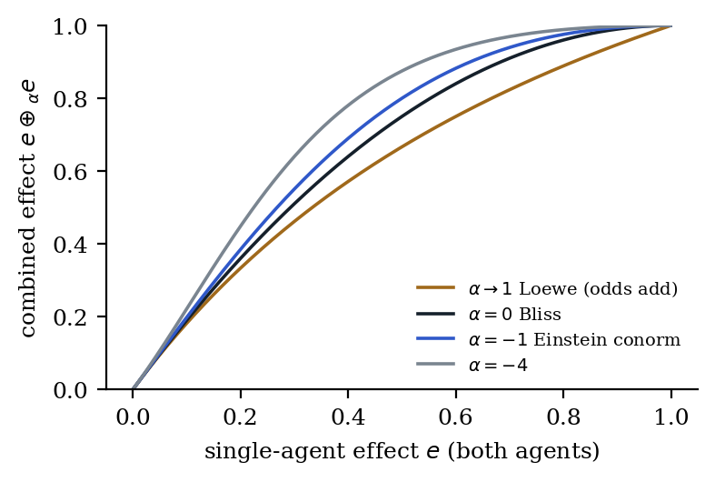

# 4. Classification by horizon count

Once composition is projective, the number of horizons fixes the law. Two horizons force Einstein composition uniquely. One horizon allows exactly one continuous family, and each classical drug-combination law with Hill slope 1 sits on it.

## 4.1 The projective condition and where it comes from

A composition is **projective** when each partial map $x\mapsto a\oplus x$ is a Möbius map, that is, a ratio of linear functions. Boundedness does not make a law projective (§2.4). Projectivity has to be earned, and the following theorem says how.

**Theorem 6 (observation projection; Murray 2026a).** Suppose the world carries two channels that update linearly, $z'=Mz$ with $M\in GL(2,\mathbb R)$. Suppose the observer identifies all common rescalings $z\sim\lambda z$ and reads only $q=z_1/z_2$ on the chart $z_2\ne0$. Then:

1. **Forward.** Every observed transition is fractional-linear on states with $cq+d\neq0$, and cross-ratios of any four states are preserved:
$$q'=\frac{aq+b}{cq+d},\qquad ad-bc\neq0.$$
2. **Converse.** Let a map from a real interval into the projective line be continuous and injective, and let it preserve all cross-ratios. Then it is the restriction of a fractional-linear map, and it has a two-dimensional homogeneous linear representative that is unique up to a nonzero scalar.
3. **Continuous form.** If the world evolves as $\dot z=Az$ with $A=\begin{pmatrix}a&b\\c&d\end{pmatrix}$, then $q$ obeys the Riccati equation $\dot q=b+(a-d)q-cq^2$.

Status: [P]. All three items are classical: projectivisation $GL(2)\to PGL(2)$; the converse, since a cross-ratio-preserving map is fixed by the images of three points; and the linear–Riccati correspondence. Murray (2026a) states the converse in this observational form and uses cross-ratio as a parameter-free empirical test.

Invertibility gives injectivity but not positivity. For $q$ to stay in a positive chart, $M$ must also preserve the positive cone.

**Proposition 5 (the generator is the observer's Riccati field).** On $[0,1]$ a projective law is generated by a quadratic vector field, and its rapidity satisfies $\psi' X=1$:
$$X(e)=A+Be+Ce^2,\qquad \psi(e)=\int\frac{de}{X(e)}.$$
This is item 3 of Theorem 6 with $A=b$, $B=a-d$ and $C=-c$. A horizon is an end where the field vanishes. Theorems 7 and 8 therefore classify the continuous observer laws of Theorem 6 by where their fixed points sit. Status: [P].

A Möbius *transition* becomes a projective *composition law* when two further things hold:

- the admissible updates form a one-parameter group acting simply transitively on $I$;
- each state is the image of $e$ under exactly one update.

So the projective condition reduces to three assumptions:

- a linear two-channel world;
- a ratio-reading observer;
- updates that form a one-parameter group.

Examples are common:

- **Velocity** is the ratio of two linearly transformed channels, $x$ and $t$.
- **Odds** are a ratio of two likelihood channels.
- **Occupancy** is fixed by the ratio of bound to free.

**Corollary (projective equivalence; Murray 2026a).** Suppose two domains independently read scale-blind coordinates of homogeneous linear processes. Then their transformation families belong to the same projective class. The same observational constraint gives the same mathematics, but the same mathematics does not imply the same physics. Status: [P].

This corollary is why one law recurs in relativity, multilayer optics, the Smith chart, binary inference and two-allele selection. Its converse caution also matters. A scalar can close perfectly well in a non-projective chart, so a failure of cross-ratio preservation does not by itself imply hidden state (Murray 2026a).

## 4.2 Two horizons force Einstein

**Theorem 7 (two horizons).** A projective group law on the open interval $(0,1)$ (both ends are then horizons, Theorem 1) has $X(e)=c\,e(1-e)$. Its rapidity, up to scale, is the logit measured from the resting state $e_0$, $\psi(e)=\log[e/(1-e)]-\log[e_0/(1-e_0)]$. When $e_0=\tfrac12$, the maximum-entropy point, $s=2e-1$ gives $\psi=2\operatorname{artanh}s$, which is Einstein composition on $(-1,1)$; any other $e_0$ gives the same law conjugated by a rapidity shift.

Status: [P]. The condition $X(0)=X(1)=0$ forces $A=0$ and $B=-C$.

The resulting operation, $xy/[xy+(1-x)(1-y)]$ on $(0,1)$ (it is undefined at the endpoint pair $(0,1)$), is the standard logit uninorm of fuzzy aggregation (Dombi 1982; Fodor, Yager and Rybalov 1997). What Theorem 7 adds is uniqueness: under projectivity, the logit law is, up to the position of its resting state, the only law whose resting state lies between two horizons. This is the precise sense in which Einstein composition is canonical.

**Physical origin.** By Theorem 3, maximum entropy over two microscopic states gives the Einstein chart for energy-additive contributions: spins in fields, and binding sites modulated through their affinity. Status: [D]. Weight-additive contributions give Loewe additivity instead (§4.5).

## 4.3 One horizon gives one dial

**Theorem 8 (one horizon).** Suppose a projective law rests at $e=0$, has its horizon at $e=1$, and has no interior fixed point. Then for some $\alpha\le1$:
$$X(e)=(1-e)(1-\alpha e),\qquad \psi_\alpha(e)=\frac{1}{1-\alpha}\log\frac{1-\alpha e}{1-e},\qquad a\oplus b=\frac{a+b-(1+\alpha)ab}{1-\alpha ab}.$$
The classical laws are points on this dial:

- **$\alpha=0$: Bliss independence.** $1-e$ combines by multiplication.
- **$\alpha\to1$: Loewe additivity.** This limit is parabolic, and odds add. It is the parabolic boundary of the dial, as flat addition is in Theorem 4.
- **$\alpha=-1$: the Einstein t-conorm** $(a+b)/(1+ab)$ restricted to $[0,1)$. On $[0,1)$ it rests at 0 and has one horizon. The same formula on $(-1,1)$ rests at 0 between two horizons (Theorem 7). The formula is shared, but the laws are different.
- **$\alpha\to-\infty$: a limit, not the logit law.** The rescaled field tends to $e(1-e)$, but the operations tend to the discontinuous drastic sum. The logit law is not a member of this family; it is the two-horizon case of Theorem 7.

Status: [P] for the family; [D] for the placement of the drug laws. $\psi_\alpha$ is the additive generator of the Hamacher t-conorm with parameter $\lambda=1-\alpha\ge0$. Hamacher (1978) showed that these are the only t-norms and t-conorms that are rational functions (Klement, Mesiar and Pap 2000).

{width=62%}

Three remarks place the dial:

- **Tsallis composition.** The Tsallis $q$-sum $x+y+(1-q)xy$ with $q>1$ is the Bliss point after rescaling. With $e=(q-1)x$ it becomes $e_1+e_2-e_1e_2$, with ceiling $1/(q-1)$. Status: [P].
- **The marked triple.** Murray (2026e, Theorem B) found exactly four boundary-identity Möbius flows when fixed points are restricted to $\{0,1,\infty\}$. On the dial these are $\alpha\in\{0,1\}$ and their mirror images (§4.4). Every other $\alpha$ has its second fixed point at $1/\alpha\notin\{0,1,\infty\}$. So the "exactly five classes" of Murray (2026b) require that restriction, and Theorem 8 gives the full one-horizon family.
- **Hill slope.** Loewe additivity sits on the dial only for Hill slope 1. For slope $n$, Loewe additivity adds $[e/(1-e)]^{1/n}$, which is not projective for $n\neq1$ (Murray 2026z).

## 4.4 Duality

The exchange $e\leftrightarrow1-e$ maps the family resting at 0 onto the family resting at 1:

- Inverse-odds combination is Loewe read from the other side.
- Multiplicative combination is Bliss read from the other side.

The five classical drug-combination laws are therefore five landmarks:

- two points on one dial: Bliss at $\alpha=0$, and its parabolic end, Loewe;
- their two mirror images;
- the separate, self-dual two-horizon logit law.

## 4.5 How the system chooses its point

Mass action selects the landmark (Murray 2026b, 2026z). Status: [D].

- **Two agonists at one shared site** add Boltzmann weights, which gives Loewe additivity.
- **Independent mechanisms** give Bliss independence.
- **Two modulators that each multiply an affinity** add energies, which gives the logit law.

Existing frameworks also unify Bliss and Loewe by fitting interaction surfaces: Greco, Bravo and Parsons (1995), BRAID (Twarog et al. 2016) and MuSyC (Meyer et al. 2019). The dial differs from these in one respect. It is not a fitted surface; it is the complete one-horizon family forced by projectivity, and its parameter has a mechanistic reading.

**Hypothesis H1 (restated).** For two agents that act on the same molecular target, the combination surface follows Loewe additivity computed from the fitted single-agent curves; for agents with independent mechanisms it follows Bliss independence. The dial position $\alpha$ is a valid one-number summary of that prediction only when both agents have Hill slope near 1 and full efficacy, because Loewe additivity leaves the projective dial otherwise (§4.3). Version 1.0 stated H1 as "$\alpha$ measures mechanistic overlap"; that form was tested and failed (§13.3). Loss condition for the restated form: across a screen with replicates and many shared-target pairs, the Loewe surface fits shared-target pairs no better than the Bliss surface does.

# 5. Associativity is the compression of history

C2 says that a lawful bounded system's present state summarises its past. Changes drawn from one law forget their order. When the associativity of a multi-dimensional law fails, the order is kept as holonomy.

## 5.1 The present is the sum of the past

**Theorem 9.** Let a system receive changes $a_1,\dots,a_n$ that combine under one law satisfying C1–C4. Then its state is
$$x_n=\psi^{-1}\Big(\sum_i\psi(a_i)\Big).$$
The state carries the net effect of the past but not its grouping. The law is commutative (Theorem 1), so the order of events is also forgotten. Status: [P]. Murray (2026o, Theorem 3) proves the same result as "terminal additive compression is order-free".

**Proposition 6 (when one dimension remembers order).** Order is forgotten in one dimension exactly when the maps representing the changes commute. This holds in particular when every change acts by composing with a fixed element of one law, that is, by a translation in one rapidity (Theorem 12). Changes that act by non-commuting maps keep order in a single bounded scalar. Two examples:

- **Affine maps.** Take $x=\tanh z$ with changes $T_d:z\mapsto qz+b(d)$, $q\ne1$. Then "$a$ then $b$" minus "$b$ then $a$" equals $(q-1)[b(a)-b(b)]\neq0$ (Murray 2026p).
- **Different composition classes.** Generators from different classes do not commute in $\mathfrak{sl}(2,\mathbb R)$, so they give order effects between classes (Murray 2026b).

**A test for a shared rapidity.** Let two small interventions act as flows of the vector fields $f(x)\partial_x$ and $g(x)\partial_x$, with sizes $\varepsilon$ and $\eta$. Then "$f$ then $g$" minus "$g$ then $f$" equals $\varepsilon\eta\,(fg'-gf')+O(3)$. If $fg'-gf'=0$ on an interval where $f\neq0$, then $(g/f)'=0$, so $g=cf$ and both interventions are translations in the one rapidity $\psi=\int dx/f$. The order effect measured across states is therefore a direct test of whether two mechanisms share a composition law, before any chart is fitted.

Status: [P] (A.18).

More generally, order effects probe the commutator of two change generators, and effects of waiting probe the commutator of a generator with the free evolution. Neither is forced by the other (Murray 2026o).

**Proposition 7 (dynamic closure; Murray 2026n).** Suppose waiting forms one autonomous semigroup $r_\Delta$ on states. Then the time $T_R$ to reach a threshold obeys
$$T_R\big(r_\Delta(a)\big)=T_R(a)-\Delta.$$
C2 covers the grouping of changes; this is its analogue for the passage of time. A failure of this identity shows that waiting is not one autonomous semigroup on this state: either the law changed over time (case 5 of Theorem 18) or the state is incomplete (Case I of Proposition 1). Status: [P].

**Theorem 10 (state–law descent).** A future law exists on a proposed present $x$ if and only if the conditional distribution of futures is the same, under every admissible intervention, for all histories that $x$ identifies. Status: [P]. This is the classical construction of causal and predictive states (Nerode 1958; Crutchfield and Young 1989; Shalizi and Crutchfield 2001; Littman, Sutton and Singh 2002). Murray (2026a, 2026h, 2026i, 2026m) applies it to biological state and to experimental action.

Two corollaries follow:

- **Matched presents refute statehood.** Two systems at the same present with different futures under the same intervention show that $x$ is not a state.
- **No reparameterisation can rescue a failed state.** A transform of $x$ cannot recover a distinction that $x$ has already erased.

**Statehood and composition are separate gates.** A sufficient predictive state does not by itself supply a binary composition on values. Two interventions can send the rest state to the same value yet act differently from another starting value. A composition law on values exists only if the **action gate** holds: *an intervention's endpoint from rest determines its action from every state*. The gate is tested by preparing two interventions with equal endpoints from rest and applying each from a second starting state (§13, step 2). Status: [P] (A.3).

Three objects must also be kept apart. Order dependence of action maps, reassociation defects of a reduced composition law, and curvature of an independently justified smooth structure are different things; composition of functions is always associative, and which of the three a measurement probes must be stated.

Associativity is the scalar, compositional case of state–law descent (A.3). A measured failure of grouping-independence does not by itself say what failed. It rejects at least one of the following:

- the context-free encoding of the changes;
- associativity of the underlying maps;
- the endpoint model;
- the predictive sufficiency of the scalar.

Pooling over latent types can also produce an apparent failure (Murray 2026p). Attributing the failure to hidden state requires a matched-present test (Theorem 10; §13, step 0). Status: [P].

## 5.2 Two or more dimensions: order can be stored as holonomy

In two or more dimensions, bounded composition may be associative or not. The author's classification decides which structures are possible.

**Proposition 8 (the bounded-composition dichotomy; Murray 2026f, Theorem 6.3).** Let $\oplus$ act on the open ball $B^n$, $n\ge2$, with the following properties:

- it is smooth, with an identity, left inverses and the left inverse property;
- it is $O(n)$-equivariant;
- on each line through 0 it restricts to $(s+t)/(1+st)$;
- its reassociation defects preserve Euclidean distances.

Then exactly one of two branches holds:

- **(F) Flat.** $\oplus$ is associative, every defect is the identity, and $u\oplus v=\Phi^{-1}(\Phi u+\Phi v)$ with $\Phi(u)=\operatorname{artanh}(|u|)\,\hat u$.
- **(H) Hyperbolic.** $\oplus$ is not associative. It is a rapidity-scaled Einstein gyro-addition of constant curvature $-\lambda^2$, and every defect is a Thomas–Wigner rotation.

No positively curved law exists: completeness together with Bonnet–Myers would force compactness, and the ball is not compact. The equivariance hypothesis is sharp:

- for $n\ge4$, $SO(n)$ suffices;
- for $n=3$, parity is needed, since otherwise there is a family of chiral laws;
- for $n=2$, the $SO(2)$ case is open.

Status: [P].

**Corollary (the selector; Murray 2026f).** Under these conditions, one failure of associativity anywhere forces hyperbolic geometry everywhere. Status: [P].

Holonomy is therefore not a consequence of boundedness. It is an empirical selector between the two branches. In branch (H), changes composed in either order agree up to a rotation, the gyration:
$$a\oplus b=\operatorname{gyr}[a,b]\,(b\oplus a).$$
Composing around a closed loop returns the system with a residual rotation. In the Poincaré disk, the angle of $\operatorname{gyr}[a,b]$ equals the area of the hyperbolic triangle with vertices $0$, $a$ and $a\oplus b$ (equivalently $0$, $-a$ and $b$), by the angle-defect (Gauss–Bonnet) formula. It is not in general the area of the triangle $0$, $a$, $b$; the two agree when $a\perp b$. For $a=0.5$, $b=0.5i$ both areas are $0.48996$ and the gyration is $-0.48996$ rad (clockwise for a counterclockwise loop); for $a=0.4+0.2i$, $b=0.7e^{2i}$ the gyration is $-0.60035$ rad, the area of $(0,a,a\oplus b)$ is $0.60035$ and that of $(0,a,b)$ is $0.61264$. Status: [P] (Ungar 2008).

So in branch (H), a bounded lawful system stores two things:

- its net state, which is the sum of its past;
- a rotation, which records the order of that past.

The record is compressed but not erased, and its size is the area the history swept out. Status: [D] for this reading. In branch (F), order is forgotten, as in one dimension.

Two measured systems are in branch (H):

- **Relativity:** Thomas precession.
- **Multilayer optics:** composing two lossless multilayers produces a Wigner rotation, equal to the anholonomy of the closed circuit in the unit disk (Barriuso et al. 2004; Murray 2026r). This is the $SU(1,1)$ analogue of, and distinct from, the Pancharatnam phase on the Poincaré sphere, which is holonomy on $S^2$ and belongs to the compact case of Theorem 27.

The general statement is that curvature is the obstruction to forgetting order. An ordered sequence of actions factors through its multiplicities if and only if the generating actions commute. Status: [P] (Murray 2026h, Theorem 5).

The flat simplex (A.12) has its own way of keeping order. With more than two types, order can be carried by a divergence-free probability current, and only time-reversal asymmetry can detect it (Murray 2026y).

# 6. Motion: inertia, invariance and interaction

## 6.1 The inertial law

**Theorem 11.** Under a constant drive $k$, $\psi(x(t))=\psi(x_0)+kt$. Status: [P].

The same motion looks different in each chart:

| Chart | Rapidity | Uniform motion looks like |
|---|---|---|
| Two horizons (logit) | $\log[e/(1-e)]$ | the logistic curve |
| One horizon, $\alpha=0$ (Bliss) | $-\log(1-e)$ | first-order saturation, $1-e^{-kt}$ |
| One horizon, $\alpha\to1$ (Loewe) | $e/(1-e)$ | the hyperbola $kt/(1+kt)$ |

So the logistic curve, first-order saturation and the Michaelis–Menten hyperbola are one inertial law seen through three charts. None of them requires a force.

**Corollary (feedback detector).** Under nominally constant drive, plot $\psi(x(t))$. A straight line means no feedback and a state-independent increment. A bend means one of three things:

- feedback;
- a changing drive;
- an increment that depends on the state.

Diploid selection with dominance is an example of the third. Its logit increment is $a_0+a_1x+\cdots$, with $a_0=\ln(1+hs)$, and the bend involves no feedback (Murray 2026x). Status: [D].

## 6.2 The invariance principle

**Theorem 12.** Composing with a fixed element $m$ is a translation by $\psi(m)$ in rapidity, whatever the starting point. Status: [P].

A mechanism that acts by composition therefore has one baseline-free effect size: the rapidity shift in its own chart.

- **Two-horizon mechanisms:** the log odds ratio.
- **Independent-hazard mechanisms:** $-\log[(1-e_1)/(1-e_0)]$.
- **Multiplicative mechanisms:** the log risk ratio.
- **Shared-site mechanisms:** the difference in odds.

The exact empirical test of Theorem 12 is kinematic closure (Murray 2026n, Theorem 1). A challenge acts by composition if and only if every challenge curve's derivative is a translate of one function $h'$.

Clinical epidemiology still debates which effect measure is portable across baseline risk. Engels et al. (2000), Deeks (2002) and Zhao et al. (2022), the last across 64,929 Cochrane meta-analyses, found the risk difference more often heterogeneous. Poole, Shrier and VanderWeele (2015) argue that this may partly reflect power. Wang (2022) shows that which measure looks homogeneous depends on the coordinates chosen. See also Doi et al. (2022) and Colnet et al. (2023).

UHL's answer is that mechanism picks the coordinate. No single measure is universally portable. But the flat risk difference should be the least portable of all, because it ignores the nonlinearity of every chart near the horizons.

**Hypothesis H2.** Across trials of one intervention at many baseline risks, the rapidity shift in the chart predicted by mechanism is constant, and the flat risk difference is not. Because the log odds ratio is non-collapsible, H2 must be tested on stratum-level effects. Test and first result: §13. Loss condition: on stratum-level data, the flat risk difference is as homogeneous across baselines as the mechanism-predicted rapidity shift.

## 6.3 Coupled rapidities: the interaction law

Take two bounded quantities with rapidities $\psi$ and $\varphi$ that drive each other. Assume:

- **A0 (state).** $(\psi,\varphi)$ is a state and its motion is autonomous and $C^1$: $\dot\psi=F(\psi,\varphi)$, $\dot\varphi=G(\psi,\varphi)$.
- **A1 (inertia).** With the coupling switched off, $F=k_1$ and $G=k_2$.
- **A2 (lawful coupling).** The law is unchanged when one fixed mechanism acts on both quantities: $\psi\to\psi+a$, $\varphi\to\varphi+ca$, with $c\neq0$.

**Theorem 13 (interaction law).**

- (a) If the law is unchanged under *separate* shifts of $\psi$ and $\varphi$, then $F$ and $G$ are constant. Full invariance forbids state-dependent interaction: coupling can at most shift the drives by constants.
- (b) Under A0 and A2, rescale $\varphi$ by $1/|c|$. Then $F=f(\Delta)$ and $G=g(\Delta)$, with $\Delta=\psi-\sigma\varphi$ and $\sigma=\operatorname{sign}c$. The relative rapidity obeys a closed one-dimensional law.
- (c) At a zero $\Delta^*$ of $\dot\Delta$ the pair is **locked**: both move uniformly in rapidity, with $\dot\varphi=\sigma\dot\psi$ (one common speed when $c>0$).

Status: [P]. Invariance gives $\partial_\psi F+c\,\partial_\varphi F=0$, whose solutions are functions of $c\psi-\varphi$. A1 is not used here; it fixes the drives in Theorem 14.

So lawful interaction acts through relative state, the observer equation of §11 written in rapidity. It requires a shared mechanism and therefore a shared rapidity unit. The same reduction to a relative coordinate is standard in phase-oscillator theory (Kuramoto 1984; Pikovsky, Rosenblum and Kurths 2001). What is new is its derivation from lawful composition and its transfer to bounded quantities.

**Theorem 14 (symmetry).** Take $c>0$, so $\Delta=\psi-\varphi$. Write $F=k_1+h_1(\Delta)$ and $G=k_2+h_2(\Delta)$, with $h_i$ independent of the drives. Add three assumptions:

- **A3 (exchange symmetry):** invariance under $(\psi,\varphi,k_1,k_2)\to(\varphi,\psi,k_2,k_1)$, that is, $h_2(\Delta)=h_1(-\Delta)$.
- **A4:** the coupling conserves $\psi+\varphi$: $h_1+h_2=0$.
- **A4′ (attraction):** the coupling reduces $|\Delta|$ near 0.

Then $\dot\Delta=\Phi-2\beta u(\Delta)$, where $\Phi=k_1-k_2$, $\beta\ge0$, and $u=-h_1/\beta$ is odd. $u$ is normalised by $u'(0)=1$ when $h_1'(0)\neq0$. Every odd $u$ is admissible, so invariance does not choose among linear, tanh, sin and sinh couplings.

Now relax A3–A4 to unequal strengths $\beta_1$ and $\beta_2$. Whenever a lock exists, meaning $\Phi/(\beta_1+\beta_2)$ lies in the range of $u$, the locked speed is $(\beta_2k_1+\beta_1k_2)/(\beta_1+\beta_2)$ for every $u$. Status: [P].

**Theorem 15 (what forces sinh).** Add two more assumptions:

- **A5:** the coupling is the net of two opposing fluxes in detailed balance, $r_+/r_-=e^{\Delta}$.
- **A6:** a rapidity shift multiplies each one-way rate by a factor that does not depend on the starting point.

Assume also that $r_+$ is continuous and positive, and that exchange symmetry acts on rates as $r_-(\Delta)=r_+(-\Delta)$. Then $r_\pm=r_0e^{\pm\Delta/2}$, and the net coupling is $2r_0\sinh(\Delta/2)$.

A5 fixes the rapidity unit: $\Delta$ is a free-energy difference in units of $k_BT$. Without the rate form of exchange symmetry, the exponent $a$ in $r_+=r_0e^{a\Delta}$ is free, and the net coupling is $2r_0e^{(a-1/2)\Delta}\sinh(\Delta/2)$. Status: [P] given these assumptions.

Without A6, detailed balance and the rate form of exchange symmetry force only $2q(\Delta)\sinh(\Delta/2)$, with $q$ even and positive. Glauber kinetics (a tanh coupling) and linear coupling are both members of that family. So a sinh coupling is the signature of exponential, Arrhenius-type exchange, not of invariance. This corrects Murray (2026u), where the sinh form was postulated by analogy.

**Theorem 16 (locking).** For $\dot\Delta=\Phi-2\beta u(\Delta)$, the function $V=2\beta\int_0^\Delta u-\Phi\Delta$ satisfies $\dot V=-\dot\Delta^2\le0$. Three cases follow:

- **Strictly increasing, unbounded $u$ (linear, sinh), $\beta>0$.** A unique, globally stable lock exists for every $\Phi$. Unboundedness alone is not enough: a non-monotone unbounded $u$ can have several locks. For $u=\sinh\Delta$ it sits at $\Delta^*=\operatorname{arsinh}(\Phi/2\beta)$. For the detailed-balance form of Theorem 15, $u=2\sinh(\Delta/2)$, it sits at $\Delta^*=2\operatorname{arsinh}(\Phi/4\beta)$.
- **Bounded $u$ (tanh).** A lock exists only if $|\Phi|<2\beta$. As $|\Phi|\to2\beta$ the locked gap $\Delta^*=\operatorname{artanh}(\Phi/2\beta)$ diverges and the relaxation rate $2\beta[1-(\Phi/2\beta)^2]$ falls to zero (critical slowing). The speeds do not jump: the locked speed $(k_1+k_2)/2$ equals both unlocked speeds at $|\Phi|=2\beta$, and beyond it the long-run drift of the gap rises linearly from zero, $\operatorname{sgn}\Phi\,(|\Phi|-2\beta)$, a kink in $\Phi$, against the square-root onset of the periodic case. Beyond that, $|\Delta|\to\infty$ and the pair unlocks, with asymptotic speeds $k_1-\beta\,\mathrm{sgn}\Phi$ and $k_2+\beta\,\mathrm{sgn}\Phi$. They head to opposite horizons only if these speeds have opposite signs.
- **Periodic $u$ (sin).** A stable lock exists if and only if $|\Phi|<2\beta$; at equality it is semi-stable. Beyond that, the phase slips with period $2\pi/\sqrt{\Phi^2-4\beta^2}$ (Adler 1946).

Status: [P]. As a reading [D], the unbounded, linear and periodic couplings mirror Theorem 4: sinh is hyperbolic, linear is parabolic, and sin is elliptic.

**Corollary (trajectory alphabet).** Take piecewise-constant parameters $k_1$, $k_2$ and $\beta$. Then $\psi(t)$ is $C^1$ except at parameter changes, where its slope jumps; between changes its slope varies smoothly as $\Delta$ evolves. Lock and unlock are consequences of parameter changes, not independent causes.

After each change, $\Delta$ does one of three things:

- it relaxes exponentially to a new lock, at rate $2\beta u'(\Delta^*)$;
- if there is no lock and $u$ is periodic, it slips;
- if there is no lock and $u$ is bounded, it splits.

So within each stretch $\psi(t)$ becomes asymptotically linear after a lock or a split. During a slip it is linear plus a periodic ripple of period $2\pi/\sqrt{\Phi^2-4\beta^2}$. The approach to a lock is a smooth transient of duration about $1/(2\beta u'(\Delta^*))$, not a sharp breakpoint. In raw coordinates each asymptotically linear stretch is one sigmoid (Theorem 11).

In the deterministic model, a trajectory is therefore a word in three letters: coast or lock, slip, and split. Its letters change only at parameter changes. Status: [D].

Two limits of scope apply:

- **Inertia is required.** The alphabet requires A1. Any restoring term bends $\psi(t)$ inside a stretch.
- **It is not a history.** A sigmoid is a response shape, not a history representation (Murray 2026p).

This commuting alphabet is distinct from what Murray (2026h) calls Temporal Grammar, which is the non-abelian branch of predictive closure.

