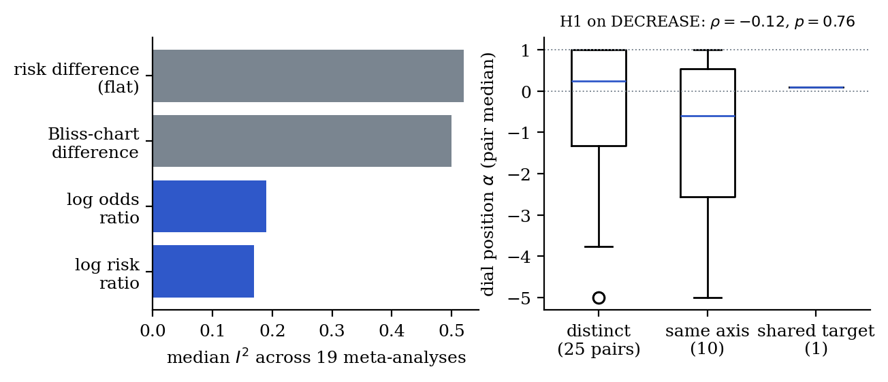

# Part III — The Test

# 13. The protocol, and two results

One protocol checks any bounded quantity against the law, often with data that already exist. Each step either confirms a condition in that system or locates the one that fails.

## 13.1 Protocol

0. **Earn the state.** Prepare the same present by different histories and apply the same intervention (Theorem 10). Different futures mean the quantity is not a state (Case I), and nothing below applies. Before fitting a projective point map, check that repeated preparations under one action give a next state within measurement error (the Point-Map Gate of Murray 2026a).
1. **Name the quantity and its horizons.** State the ceiling(s), the resting state, and whether the resting state is interior (group) or at an end (monoid).
2. **Test the action gate, grouping and waiting.** Prepare two interventions with equal endpoints from rest and apply each from a second state; different results fail the action gate (§5.1). Compare $(a\oplus b)\oplus c$ with $a\oplus(b\oplus c)$; test waiting with dynamic closure (Proposition 7). Measure the order effect of pairs of small interventions across states; a vanishing $fg'-gf'$ shows a shared rapidity (Proposition 6). Disagreement rejects the encoding, associativity, the endpoint model or sufficiency (§5.1); use step 0 to decide which.
3. **Identify the chart.** Fit the one-horizon dial or the two-horizon logit and compare with the chart mechanism predicts (§3.1, §4.5). Where projectivity is claimed, test it with cross-ratio (Theorem 6). A failed cross-ratio test rules out projectivity, not closure.
4. **Test inertia.** Under nominally constant drive, check that $\psi(x(t))$ is straight; read a bend as feedback, a changing drive or a state-dependent increment (§6.1). Fit medians (Theorem 21).
5. **Test invariance.** Check which chart's rapidity shift is constant across baselines, on stratum-level effects (§6.2); the exact form is kinematic closure (Murray 2026n).
6. **Measure the boundary exponent and the cost of approach.** From the approach to the ceiling under known drive, estimate $\gamma$ (and, for noisy systems, the noise exponent $\beta$). $\gamma\ge1$ predicts a horizon; $\gamma<1$ predicts arrival (Proposition 9). For a maximum-entropy average, predict $\gamma$ from the reference measure (Proposition 3: 1 for an isolated atom, 2 for a power-law density with no atom, $1+1/(a+2)$ for an atom beside a density $\sim u^a$, larger than 2 for a density vanishing faster than any power) and check the remaining gap against $\delta(0)e^{-L\int k}$.
7. **Audit boundary arrivals.** For every observed arrival identify the broken condition (Theorem 18).
8. **In two or more dimensions, identify the cone, the update class and the comparison.** Decide from the channels whether the cone is orthant, Lorentz or matrix, whether each intervention is reversible or forward-only (does it preserve, contract or erase projective distances?), and which distance the observer measures (Theorem 25); test commutation of updates; estimate signed curvature from reassociation defects (Murray 2026f, App. B); for state spaces built from history, compute Gromov $\delta$ and best-fit curvature (H7).

**A caution on power.** In the linear-quadratic dose class, agreement across challenge amplitudes and zero-gap order tests has exactly zero power against hidden state (Murray 2026n, Theorem 2). A pass in such a class is not evidence of a closed state.

Pre-register the predicted chart, dial position, ceiling, exponent and cone before any held-out data are examined, together with the loss condition.

## 13.2 First result: which effect scale travels?

We ran step 5 in its weakest form on 19 public meta-analyses of two-arm trials with binary outcomes (*metadat*; White et al. 2026), control-group risks 0.02% to 89%, computing $I^2$ for four effect measures.

| Measure | Median $I^2$ | Lower $I^2$ than the risk difference | Wilcoxon $p$ vs risk difference |
|---|---|---|---|
| Risk difference (flat) | 0.52 | — | — |
| Log risk ratio | 0.17 | 14 of 19 | 0.001 |
| Log odds ratio | 0.19 | 14 of 19 | 0.001 |
| Bliss-chart difference | 0.50 | 11 of 19 | 0.019 |

In five meta-analyses all measures had $I^2=0$. Among the other 14, the flat risk difference was the least consistent in 11. This is a small replication of Engels et al. (2000), Deeks (2002) and Zhao et al. (2022, 64,929 Cochrane meta-analyses); Poole, Shrier and VanderWeele (2015) caution that part of the excess may reflect power. It cannot distinguish the log risk ratio from the log odds ratio, which nearly coincide for rare events, so it does not test the mechanism-specific form of H2.

## 13.3 Second result: a pre-registered test of the dial reading, which failed

Version 1.0 stated H1 as: the dial position $\alpha$ measures mechanistic overlap, near 0 for independent agents and near 1 for a shared target. We tested it on the largest set of full dose-response matrices available to us, the DECREASE validation set (Ianevski et al. 2019): 210 blocks, 8×8 matrices, 36 drug pairs, 13 cell lines. The mechanistic overlap of every pair (0 distinct, 1 same signalling axis, 2 shared target), the effect definition, the fitting procedure and the loss condition were written down before any fit (supplementary `h1_decrease/preregistration.md`). For each block, single agents were fitted by Hill curves, and $\alpha\in[-5,1]$ was fitted by least squares over the 49 interior wells.

| Test | Spearman $\rho$ (overlap vs $\alpha$) | permutation $p$ | $n$ |
|---|---|---|---|
| Primary: per-pair median $\alpha$ | $-0.12$ | 0.76 | 36 pairs |
| Per-block $\alpha$ | $-0.11$ | 0.94 | 210 blocks |
| Raw single agents | $-0.11$ | 0.74 | 36 pairs |
| Both Hill slopes in $[0.5,2]$ | $-0.13$ | 0.75 | 30 pairs |

Median per-pair $\alpha$: distinct mechanisms $0.24$; same axis $-0.60$; the one shared-target pair (everolimus with dactolisib) $0.10$, five of its ten cell lines at the upper bound $\alpha=1$ and the other five below zero, two of them at the lower bound $\alpha=-5$. Both clauses of the pre-registered loss condition were met ($\rho<0$ and $p>0.05$), in the primary test and in every sensitivity analysis. **H1 as stated in version 1.0 is refuted on this dataset.**

The failure is partly structural. Checked on exact sham combinations: the true Loewe surface sits at $\alpha=1$ only for Hill slope 1 with full efficacy; at slope 2 the dial assigns it about $\alpha=-3.5$ to $-4$, depending on the dose grid, at slope 3 it leaves the scale, and with unequal maximal effects it falls below every dial surface. In this screen the median slopes were 2.0 and 1.3, and $\alpha$ sat at a bound in 65% of blocks. The dial is the complete classification of projective one-horizon laws (Theorem 8); it is not a general synergy scale. H1 is restated in §4.5 as a claim about the two surfaces. An independent reviewer reran the analysis on the public files and reproduced the primary result exactly ($\rho=-0.12075$, one-sided $p=0.75582$, 36 pairs). The same review found a reversed bisection step in the original script's post-hoc Loewe calibration; it has been corrected; every primary and sensitivity statistic is unchanged to five decimals, and the sham-combination values quoted here come from a separate solver that did not contain the error. Limits of the run: the set was chosen by its authors as novel combinations, so it is enriched for synergy; there is one shared-target pair; wells are single replicates; the mechanistic annotations are the author's, fixed in advance, with two flagged as ambiguous.

{width=100%}

## 13.4 Next tests

| Dataset | Steps | Hypotheses |
|---|---|---|
| Combination screens with replicates and many shared-target pairs (NCI-ALMANAC, Holbeck et al. 2017; DrugComb, Zagidullin et al. 2019) | 2, 3, 6 | H1 restated, H3 |
| Stratum-level trial data spanning mid-range baselines | 5 | H2, mechanism-specific |
| Approach-to-ceiling kinetics with known mechanism (zero-order and first-order elimination; saturable transport) | 6 | Proposition 9, the exponent prediction |
| Single-cell perturbation spaces; neural state spaces | 8 | H7, item 3 of Theorem 25 |
| The Calabrese hormesis database (Calabrese and Blain 2005) | 4, 5 | zero-fit predictions of Murray (2026c); P6; P11 |
| Probability judgments across tasks within persons | 3, 4 | H5 |

## 13.5 What would refute the law

The mathematics cannot be refuted, given its conditions. What can be refuted is that a real system obeys it, and that the conditions can be told apart from outside:

- a quantity passes the grouping test (step 2) and is described systematically better by flat addition near its ceiling than by any rapidity;
- a horizon is reached with every condition intact;
- a maximum-entropy average is measured with $\gamma<1$;
- a ratio-read system with a continuous channel symmetry shows commuting reversible updates, or an orthant system shows holonomy under reversible updates;
- the two estimates of the ceiling disagree beyond error.

# Part IV — Interpretation

# 14. What the theorems license, and no more

**Limits as horizons.** For anything bounded that changes lawfully, the limit is a horizon: approachable without end, reached only by a jump that a named condition permits (Theorems 18–19). The speed of light, certainty and complete order are usually treated as separate facts; under the law they are one kind of fact. Fixation and extinction are the other kind: crossings by a discrete jump (Theorem 23).

**Why flat description felt true.** Everyday experience happens near rest, where flat and rapidity descriptions agree to within a fraction of a percent. The view was not wrong; it was local.

**The interior observer.** Homogeneity puts every observer at the centre of its own space. What a bound adds is a horizon that can be measured but not reached (Theorem 29), and, in branch (H), a perspective that carries holonomy. What the cone of the observer's channels and its admissible updates add is the invariant geometry, and forward-only updates erase distinguishability instead (Theorem 25). What finite resources add, if H7 holds, is that the space of remembered histories is negatively curved and grows with experience. These are statements about the interface between an observer and the world, not about the whole.

**History and prediction.** Lawful bounded systems compress their history into their present (Theorems 9–10). When changes come from one law the order is forgotten; when the law is non-associative in two or more dimensions, the order is kept as holonomy. Whether a biological present is a sufficient state is an empirical question (Murray 2026i), and what an observer needs in order to act is coarser still (Murray 2026q).

**Structure and bounds.** Within the lawful composition laws, flat is the parabolic boundary case. Persistent structures are forward-invariant regimes of bounded lawful dynamics, with interior fixed points as the simplest case (Murray 2026d, Cor. 7.1; 2026o). This is stated as interpretation.

# 15. Scope and claim register

The law applies wherever C1–C4 hold, or their gyro-associative form in more dimensions. Where they fail, it says only that the failure is informative (§7). The local chart is always supplied by the system (§2.4).

| Claim | Section | Status | Novelty | Check or test |
|---|---|---|---|---|
| Closure trichotomy (Prop 1) | §2.2 | P | Murray 2026a | Matched presents |
| Horizon theorem, group and monoid (Thms 1–2) | §2.3 | P | Classical (Aczél; Luce–Marley; uninorms) | — |
| Rapidity as the gradient of negentropy (Thm 3, Prop 2) | §3.1 | P | Classical, reinterpreted | Exponential families |
| Max-ent averages never reach their ceiling; exponent continuum; cost of approach (Prop 3) | §3.1 | P / D | New (bound, divergence, cost bound P; exponents D) | Step 6 |
| Energy- vs weight-additivity criterion | §3.1 | D | New | Binding assays |
| Flat as the infinite-ceiling limit; lawful mean (Prop 4) | §3.2 | P | Classical | Series; Kolmogorov–Nagumo |
| Trichotomy; flat as the parabolic boundary (Thm 4); compact case (Thm 5) | §3.3 | P / D | Classical; extension beyond kinematics D | $PSL(2,\mathbb R)$ |
| Observation projection, converse, Riccati (Thm 6, Prop 5) | §4.1 | P | Classical; observational use Murray 2026a | Cross-ratio test |
| Two horizons force the logit (Thm 7) | §4.2 | P | Small lemma (cf. Murray 2026z) | A.1 |
| One-horizon dial = Hamacher; drug laws on the dial (Thm 8) | §4.3 | P / D | Mathematics classical; placement new | A.2 |
| H1, restated (surfaces) | §4.5 | H | New; α-form refuted §13.3 | Screens with replicates |
| Present sums the past; order in 1D; shared-rapidity test; action gate; dynamic closure (Thm 9, Props 6–7) | §5.1 | P | Murray 2026n, 2026o, 2026p; bracket test and action gate stated here | Order, action and waiting tests |
| State–law descent (Thm 10) | §5.1 | P | Classical | Matched presents |
| Bounded-composition dichotomy; holonomy selects (Prop 8); abelianization | §5.2 | P | Murray 2026f, 2026h | Defect tomography |
| Inertial law; feedback detector (Thm 11) | §6.1 | P / D | Classical / new | Time series |
| Invariance; portable effect scale (Thm 12, H2) | §6.2 | P / H | Question classical; reason new | §13.2 |
| Interaction law; sinh from detailed balance; locking (Thms 13–16) | §6.3 | P | Transfer to rapidity new | A.4–A.7, B |
| Trajectory alphabet | §6.3 | D | New | Piecewise-drive experiments |
| Ceiling measurable from inside (Thm 17, H3) | §7.1 | P / H | New reading | Ceiling consistency |
| Boundary arrival (Thm 18) | §7.2 | P / D | New | Boundary audit |
| Boundary exponent unifies Osgood and Feller (Prop 9) | §7.3 | P / D | Classical parts P; unification D | Step 6 |
| Stochastic charts; no finite-time horizon; fixation (Thms 20–23) | §7.5 | P / D | Classical; reading new | B |
| The far side of the horizon (Thm 19); simultaneity instance; crossings (open) | §7.4 | P / D | Mathematics and instance classical; far-side reading of natural events open | — |
| Hyperbolic geometry given rigidity (Thm 24); dial 1D (Prop 10) | §8.1 | P | Classical; Murray 2026e | — |
| The cone and update class decide the geometry; forward-only updates contract (Thm 25) | §8.1 | P / H | Mathematics classical; reading new; item 3 prediction H | Commutation; contraction; curvature |
| Holonomy; compact isotropy (Thms 26–27) | §8.2 | P | Classical | Computed |
| Spectral threshold, not a mass gap (Thm 28) | §8.3 | P | Classical | McKean; Donnelly |
| Hyperbolic information space; trees do not fit flat space at fixed dimension and bounded distortion, and fit $\mathbb H^2$ (H7) | §8.4 | P / H | Measured by others; embedding bound P (A.20; Sarkar 2012); H7 new | Gromov $\delta$; curvature |
| Reflection chart | §9.2 | P | Classical | Optics |
| Selection as inertia; H4 | §10.1 | P / H | Classical / new | Experimental evolution |
| Bliss–Loewe gap; hormesis predictions; rescue windows | §10.2 | P / H | Murray 2026c, 2026e, 2026l | Dose data |
| Exoplanet and ATP-synthase charts | §10.3 | H | Proposed here | Loss-regime audit; affinity scans |
| Bayes as Einstein composition; H5 | §11.1 | P / H | Classical / new | Perception tasks |
| Observer centrality, group and gyrogroup cases (Thm 29) | §11.2 | P | Reading new | Geometry |
| Puzzle register (38 entries: 12 R, 11 L, 15 O) | §12 | as marked | New as a register | Sources cited |

**Completion rule.** The programme is complete when every [D], and every [P] resting on the author's own preprints, has been independently checked; every [H] has met data with its loss condition; and no row of this register is untested. This version reports one replication (§13.2) and one refutation (§13.3).

